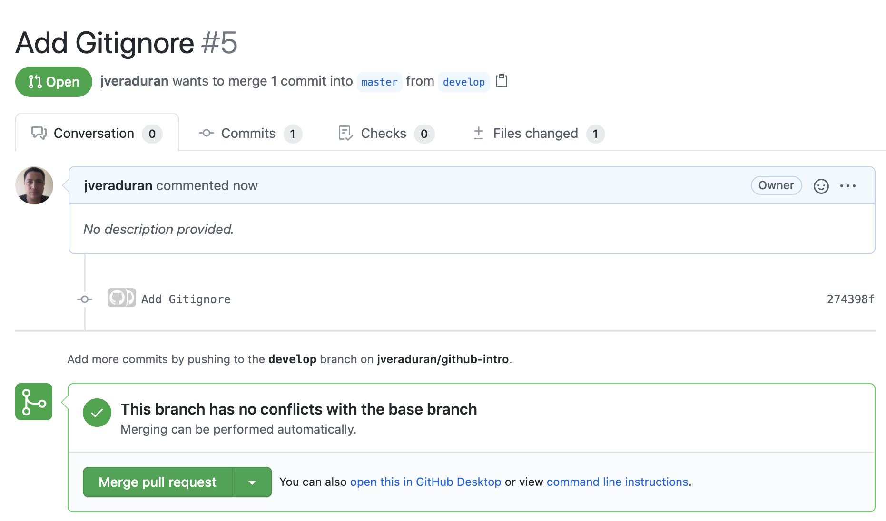

.. Renegados documentation master file, created by
   sphinx-quickstart on Tue Aug 26 14:19:49 2014.
   You can adapt this file completely to your liking, but it should at least
   contain the root `toctree` directive.

Introducción a Github
=====================

Pre-requisitos
##############

**Instalando Visual Studio**

Descarga la version para cualquier sistema desde este Link `Visual Studio Code <https://code.visualstudio.com>`_

**Instalar Git**

Descarga la version para cualquier sistema desde este Link `GIT <https://git-scm.com/downloads>`_

**Para MAC con brew**

   .. code-block:: shell
      
      brew install git

¿Qué es Git?
############

Antes de continuar, debemos entender a Git como el corazón de GitHub. Git es un sistema de control de versiones desarrollado por Linus Torvalds (el hombre que creó Linux).

|

¿Qué es un sistema de control de versiones?
###########################################

Cuando los desarrolladores hacen un nuevo proyecto, siempre continúan haciéndole modificaciones al código. Incluso después de la puesta en marcha de los proyectos, todavía necesitan actualizar las versiones, corregir errores, agregar nuevas funciones, etc.

El sistema de control de versiones ayuda a registrar los cambios realizados al código. Aún más, registra quién realizó los cambios y puede restaurar el código borrado o modificado.

No hay códigos sobrescritos ya que Git guarda varias copias en el repositorio. Si estás interesado en Git, puedes aprender más sobre Git aquí.

|

Creando nuestro primer repositorio
##################################

1. Crear un repositorio nuevo en Github llamado **github-intro-XXX** (XXX serán las iniciales de tu primer nombre y tus dos apellidos). Para evitar errores, no inicialices el nuevo repositorio con archivos README licencia o gitingnore. Puedes agregar estos archivos después de que tu proyecto se haya subido a Github.

   .. image:: ../images/repo-create.png

|

2. Ejecuta el siguiente comando en tu terminal (XXX serán las iniciales de tu primer nombre y tus dos apellidos)
    
   .. code-block:: shell
      
      mkdir github-intro-XXX

|

3. Cambiar al directorio de trabajo que acabas de crear.

   .. code-block::  shell
      
      cd github-intro-XXX

|

4. Inicializar el directorio local como un repositorio de Git.

   .. code-block:: shell
      
      git init

|

5. Crearemos un archivo llamado **README.md** como primer archivo inicial.
   
   - Para WINDOWS
   
      .. code-block::  shell
         
         type NUL > README.md
   
   - Para MAC
   
      .. code-block::  shell
         
         touch README.md

|

6. Agregar los archivos a tu nuevo repositorio local. Esto representa la primera confirmación.

   .. code-block:: shell
      
      git add .
   
   .. note::
      Agrega el archivo en el repositorio local y lo presenta para la confirmación. Para deshacer un archivo, usa 'git reset HEAD YOUR-FILE'.

|

7. Confirmar los archivos que has preparado en tu repositorio local.

   .. code-block:: shell
      
      git commit -m "First commit"
   
   .. note::
      Commits the tracked changes and prepares them to be pushed to a remote repository. Para eliminar esta confirmación y modificar el archivo, usa 'git reset --soft HEAD~1' y confirma y agrega nuevamente el archivo.

|

8. En la parte superior de la página de Configuración rápida del repositorio de Github, haz clic para copiar la URL del repositorio remoto.

   .. image:: ../images/copy-remote-repository-url-quick-setup.png

|

9. En Terminal, agrega la URL para el repositorio remoto donde se subirá tu repositorio local.

   .. code-block:: shell
      
      git remote add origin remote repository URL
   
   .. note::
      Si deseamos verificar la nueva URL seteada, ejecutamos 'git remote -v'

|

10. Sube los cambios en tu repositorio local a Github.

   .. code-block:: shell
      
      git push -u origin master
   
   .. note::
      Pushes the changes in your local repository up to the remote repository you specified as the origin

|

Realizando nuestro primer Pull Request
######################################

Un pull request es una petición que el propietario de un fork de un repositorio hace al propietario del repositorio original para que este último incorpore los commits que están en el fork. En el caso que nos ocupa, el usuario aprendegit-user1 le enviará la petición a aalbagarcia para que este último incorpore los commits que tiene en su fork.
Para realizar nuestro primer pull request, ejecutaremos las siguientes instrucciones:

|

1. Clonamos el repositorio de Github `Link <https://github.com/smu-chile/github-demo.git>`_

   .. code-block:: shell
         
         git clone https://github.com/smu-chile/github-demo.git

|

2. Crearemos una nueva rama en este repositorio con la siguiente nomenclatura **feature-XXX** (XXX serán las iniciales de tu primer nombre y tus dos apellidos)

   .. code-block:: shell
         
         git checkout -b feature-XXX
   .. note::
      Create a new branch named feature-XXX and start it at <start_point>.

|

3. Editaremos el archivo **README.md** agregando **XXX** (XXX serán las iniciales de tu primer nombre y tus dos apellidos) + Un Comentario.

|

4. Ahora ejecutaremos el comando git `add <https://git-scm.com/docs/git-add>`_

   .. code-block:: shell
         
         git add -A
   .. note::
      Update the index not only where the working tree has a file matching <pathspec> but also where the index already has an entry. This adds, modifies, and removes index entries to match the working tree.
   
   .. note::
      Otra opción seria agregar solo el archivo editado mediante el comando git add **FILENAME**

|

5. Ahora ejecutaremos el comando git `commit <https://git-scm.com/docs/git-commit>`_

   .. code-block:: shell
         
         git commit -m "Comentario"
   
|

6. Ahora ejecutaremos el comando git `push <https://git-scm.com/docs/git-push>`_

   .. code-block:: shell
         
         git push --set-upstream origin feature-XXX

|

7. Para realizar el Pull Request deberemos ejecutar la siguiente secuencia en Github UI ( Mas informacion `AQUI <https://docs.github.com/en/github/collaborating-with-issues-and-pull-requests/proposing-changes-to-your-work-with-pull-requests>`_)

|

Una vez que presiona los cambios en su repositorio, el botón de solicitud **Pull Request** aparecerá en GitHub.

|

Haz clic y serás llevado a esta pantalla

|

Abra una solicitud de **Pull Request** haciendo clic en el botón Crear **Pull Request**. Esto permite que los encargados del repositorio revisen su contribución. Desde aquí, pueden fusionarlo si es bueno, o pueden pedirle que haga algunos cambios.

|

Realizando nuestro primer Merge
###############################

|

|

|

